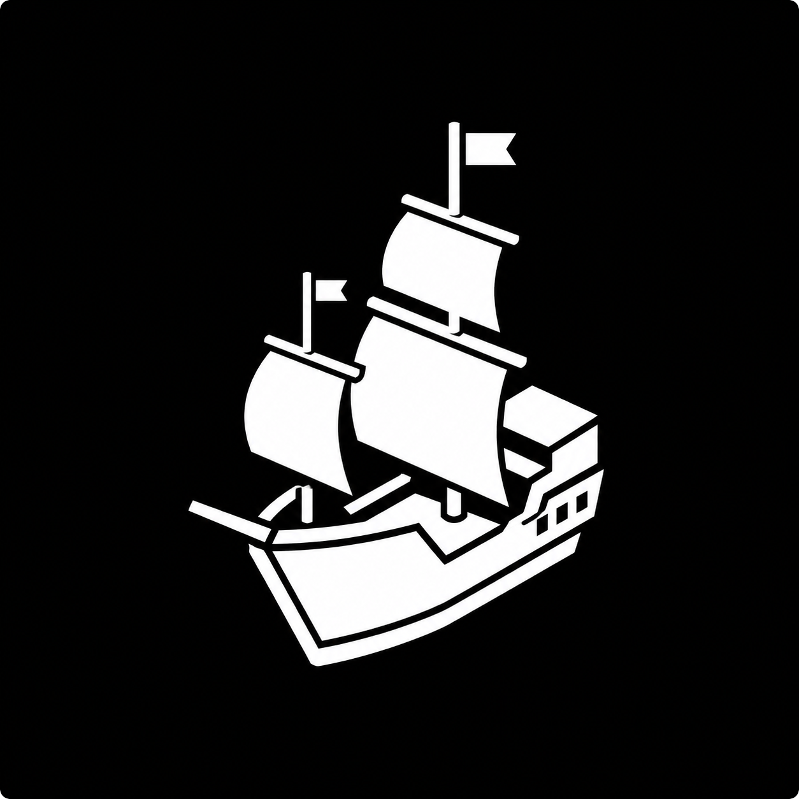

  

  
  
  

# Sail Global

Public static surface for the Sail alpha.

Sail Global collects the current landing page, bundled console build, and
release metadata in one GitHub Pages-ready repository. Plugin downloads resolve
through the official Sail GitHub release.

## Links

- Landing: [`index.html`](index.html)
- Console: [`console/`](console/)
- Gateway: [`sail-gateway.jar`](https://github.com/Hydr46605/Sail/releases/latest/download/sail-gateway.jar)
- Companion: [`sail-companion.jar`](https://github.com/Hydr46605/Sail/releases/latest/download/sail-companion.jar)
- Registry API: [`sail-registry.v1.openapi.json`](https://github.com/Hydr46605/Sail/releases/latest/download/sail-registry.v1.openapi.json)
- Release manifest: [`downloads/sail-release.json`](downloads/sail-release.json)

## Status

- Console bundle: `0.1.0-alpha.2`
- Plugin release: latest Sail GitHub release
- Gateway target: Velocity
- Companion target: Paper
- Site type: static
